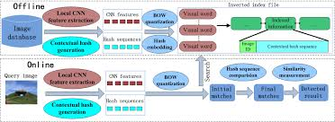
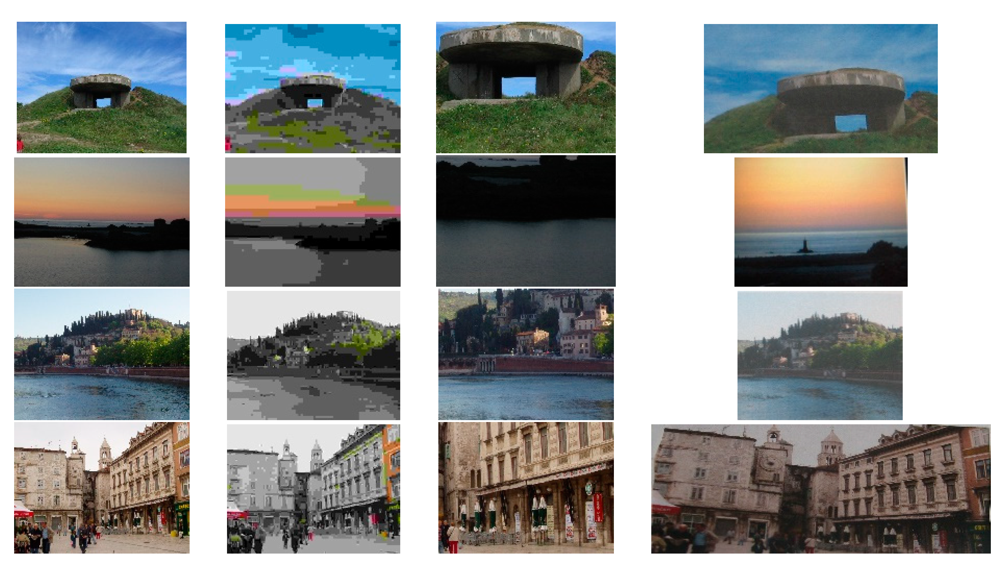

# Image-Copy-Detection-with-Contextual-Hash-Embedding

Click on here for the **Paper** [here](https://www.mdpi.com/2227-7390/8/7/1172/pdf)

**Dataset** [here](http://lear.inrialpes.fr/people/jegou/data.php#copydays)

The above Ipynb file has a pipeline as mentioned in the paper. This paper finds the Copied images from the internet. This is used for Image retrieval, Copy Detection, and to stop image thefting.

**Note** that we used ORB for extracting Features from images instead of SURF as used in paper. As SURF is a patented version, We used ORB instead for the Similar Task.

Results as shown in paper

